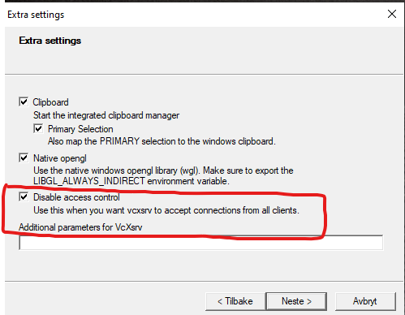
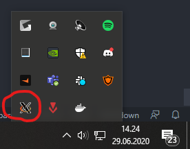
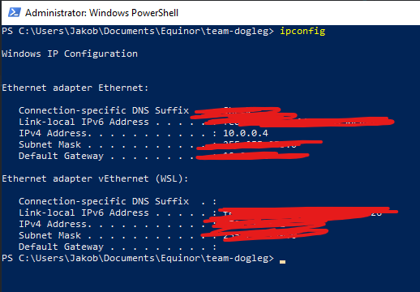

# team-dogleg
Team repo for Team Dogleg - Virtual summer internship 2020

## Run with Docker using Windows

To display the graphics of the well trajectory while running from a Docker container a few actions must be taken (credit to team wishing-well).

### Installations

Install [VcXsrv Windows X server](https://sourceforge.net/projects/vcxsrv/). This will create a server which will enable the Docker container to "communicate" with your graphics card. Download and follow the installation instructions. When downloaded, you should have a program called XLaunch on your computer. Run it, and click your way through the instructions. No modifications to the default settings are needed here, **EXCEPT** for when you are asked to enable the *Disable access control* option in the "Extras" setting. Make sure this is enabled. When you are done, XLaunch should be running. You can verify that it is running be pressing the "^" at the bottom right of your Windows toolbar. See images below.





### Building and running the Docker container

To connect the display to our docker container we need our local ip adress. Open cmd (or PowerShell as it is recommended to use later) and type `ipconfig`. Remeber you local ip adress, see image below



To build and run the docker container it is recommended to user PowerShell. With XLaunch running navigate to the folder where the DockerFile is located. Build using

```shell
~$ docker build -t my_name
```

Then, with the ip adress you found above, do

```shell
~$ set-variable -name DISPLAY -value INSERT_IP_HERE:0.0
```
Finally, run the container using
```shell
~$ docker run -it --rm --name wwrunning -e DISPLAY=$DISPLAY my_name
```